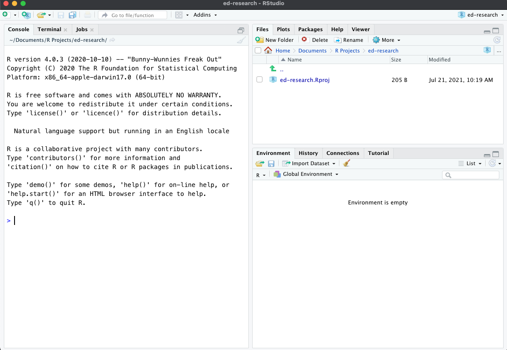
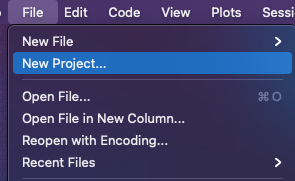

# Grounding Concepts

## A Quick tour of R and R-Studio 

Please watch the first 15 minutes of the Lesson 01 workshop video, as we give you a run down of these programs what all of these panes, tabs, and buttons do.

[Click here to watch Lesson 01](https://drive.google.com/file/d/1EYdeTYf1h-wI759Ci6w2ckWNjc194LT3/view?usp=sharing){.uri}

#### *What's the difference between R and R-Studio?*

```{r}
library(tidyverse) 
```


Both programs are able to run R.

`R` is the original program. When we install R, we are installing two things: (1) the R programming language, and (2) a Graphical User Interface (GUI) that helps us work with the R-programming language, such as running code, opening and saving files. When you open R, you will notice that the GUI contains only a few buttons and icons. R looks very simple at first sight, but it does have all of the necessary tools you would need to work with data.

`R-Studio` is an add-on to R. It has many additional features that make working with the R-programming language much easier. As you can see from opening R-Studio, the GUI has several different panes, buttons, tabs, and icons.

R-Studio also has important tools that make it easy to implement open science practices in your work, like the ability to create notebooks that replicate your data analyses. It also has tools for uploading your work to code-sharing platforms, like Github.

Because R-Studio is an add-on program, you need to ensure that you first install R on your computer. Note that when you open R-Studio, it already imports the R-programming language, so there is no need to open the R program.

We will use R-Studio exclusively for this book.

When you open R-Studio, you will see the following 3 panes

```{r echo=FALSE, out.width='100%'}

```

The `Console` pane is where you can type in lines of R code. This pane will also output the results from your code. For the sake of this book, we will primarily use the console to quickly check data, especially when we don't necessarily need to save the code. One important thing to understand about the Console pane is that it is temporary. 

```{r echo=FALSE, out.width='100%'}

```

```{r}

```

## Running and saving code in R-Studio

The Console Pane, which by default appears on the bottom-left pane in R-Studio, is the interface for entering and running code.

For the purpose of this book, we will use the console to do quick data calculations, data checks, and experiment with code. We will primarily use R-Studio to write and execute our code, especially as it pertains to creating a data notebook.

### R-Markdown Files

R-Markdown files is a document file that serves as a data notebook, where we can write text as well as lines of code. The benefit of using an R-Markdown file is that we can keep a record of everything we do, from importing our data, inspecting and cleaning variables, to analyzing and visualizing our data. This allows us to share our work with others in a completely transparent way. R-Markdown files do have some characteristics that look quite odd, but we'll address those in a bit.

### Creating a New R-Markdown File

On the top-left corner in R-Studio, select File -\> New File -\> R-Markdown

### R-Markdown Magic: Code Chunks

Let's get familiar with the concept of Code Chunks. Code chunks

This is specific feature of markdown (.Rmd) files, meaning that

## Creating code chunks in R-Markdown

There are three ways to create a Code Chunk.

1.  You can create a new chunk of code by typing the following:

    \`\`\``{r}`

    CODE HERE

    \`\`\`

    The space in between the grave markers, \`\`\``` {r}` CODE HERE ``\`\` is where we can write R code and calculations, such as 2 + 2.

2.  You can insert a code chunk using the `+c` menu button, which appears directly above your R-Markdown document. To create a code chunk, click on the `+c` button, then select R.

3.  You can also use the following keyboard shortcut

    -   alt + command + i (mac)

    -   control + alt + i (windows)

```{r}
2 + 2
```

## Running chunks of code

Now that you entered 2+ 2 in the code chunk, you can run this line of code by clicking on the green arrow to the right of the code chunk.

You can also use the following shortcuts to run the code within this code chunk:

command + enter (mac)

control + enter (windows)

## The very basics

### Simple Calculations

R works just like a calculator. You can do addition, subtraction, multiplication, etc. Here, we provide two examples, but you can experiment with calculations (+, -, \*, /, \^, etc.) on the Console Pane.

Addition

```{r}
2 + 2
```

Division

```{r}
10/2
```

### Objects & the Assignment Operator `<-`

Objects are the virtual space where we can temporarily store the data we load into R. When we want to load a .csv file into R, for example, we save it into an object. We can name these objects whatever we like, as long as it starts with a character string and does not contain special words or special characters that are exclusive to specific R commands or functions (more on this in later chapters).

Remember the simple calculations we just did? We can store those results into an object.

We do this by using the assignment operator `<-`

The assignment operator is an arrow `<-` (which is the `less than` sign and the `dash` sign). This is also what we mean by special characters---you cannot use `<-` for any other purpose in R.

Here's how it works.

Lets creating objects a, b, and c

```{r}
a <- 2
b <- 10 + 2
c <- 2 + 2
```

### Environment Pane in R-Studio

Notice that something happened to the environment pane. The environment name shows you the names of the objects we created. You will also see that the stored values are displayed to the right of the object name.

You may have also noticed that the results of a, b, and c, did not show up anywhere other than the environment pane. This is because when we use the assignment operator, we are telling R to save the results (and not displaying them).

## Learning your first function: `print()`

```{r}
print(a)
```

## Objects & Functions

### The Data Frame Object

here, I we are going to type `mtcars` in the code chunk below which is a dataframe that came pre-installed in R.

```{r}
mtcars
```

### Learning your first function in R: `str()`

```{r}

```

If you want to see less rows you can use the `head()` function.

```{r}
head(mtcars)
```

If you want to move the `mtcars` dataframe into the environment pane, you can duplicate it via the assignment command. Here, we'll save a copy of `mtcars` as `cars` and check the data using the `head()` function. Notice that I just added into the same chunk of code.

```{r}
cars <- mtcars

head(cars)
```

## View()

This allows us to view the actual raw data

```{r}
View(mtcars)
```

## A Note on Arguments

Notice that functions in R always have () beside them

head(mtcars)

In R, we put our arguments (which are things the function needs to run, and/or extra things we want the function to do) inside these parentheses.

## Learning More About Libraries and Functions

If you want to see more information about what you can do with a library like ggplot2, you can put `?` in front of the name of the library.

```{r}

```

If you want to know more about how to use a specific function put a ? in front of the function name

```{r}

```

You can even do this with sub-functions, like `element_text()`

```{r}

```
