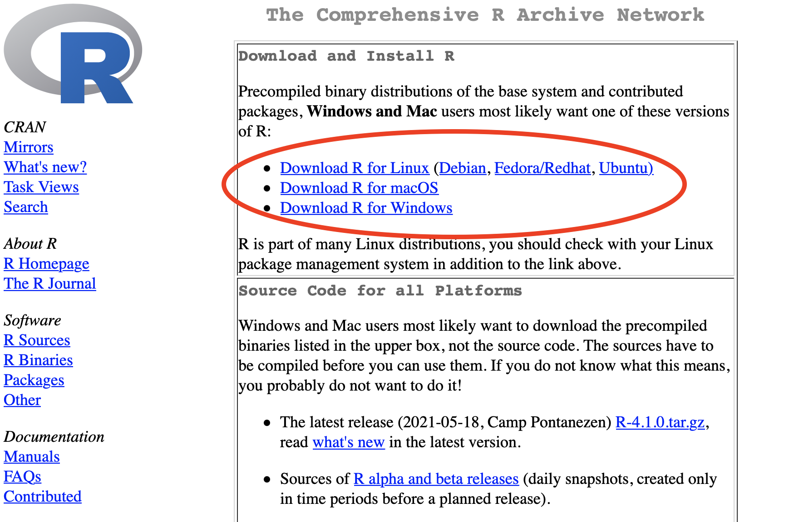
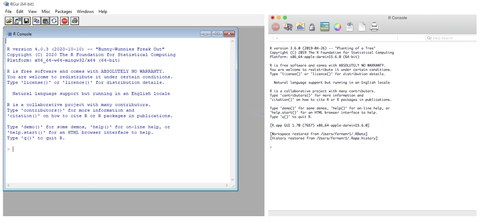
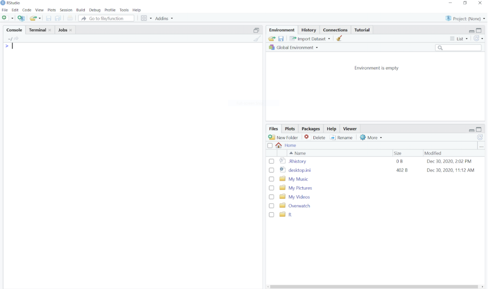

# Installing R and RStudio

The first thing we will do is install R and RStudio into our computer's hard drive. Before we begin, however, we let's quickly explain the difference between R and RStudio.

R is the original program for using the R programming language. When we install R, we are installing two things: (1) the R programming language, and (2) and the R program itself that enables us to run and save our code, otherwise known as the Graphical User Interface (GUI).

## Installing R

To install R, visit the Comprehensive R Archive Network website, which can be found here <a href="https://cran.r-project.org/" target="_blank">(<https://cran.r-project.org/>)</a>. You can right click on this link and select <i>open in new tab</i>.

You have the option of downloading R for Linux, MacOS, or Windows. This information is typically the first set of links (see image).

```{r echo=FALSE, out.width='100%'}

```

If you are have trouble finding your way around the Comprehensive R Archive Network website, you can watch the following video.

<a href="https://drive.google.com/file/d/1WGmdTNg9cmffq89UGMMLvz0UwBNWAwf0/view?usp=sharing" target="_blank">Watch: How do download R</a>

After downloading and installing R, click on the R icon that was created on your application folder or desktop menu. You should see a window open similar to the images below. The Windows version on the left and the Mac version is on the right. This is the program, which we also refer to as the GUI (Graphical User Interface). Notice that the R program GUI contains only a few buttons and icons. The R program GUI looks very simple, but it does have all of the necessary tools you would need to work with data.

```{r echo=FALSE, out.width='100%'}

```

## Installing RStudio

RStudio also runs the R programming language, but it has additional features that make coding in R much easier. Because RStudio is an add-on program, you need to ensure that you installed R before installing RStudio.

Please use the following link to download RStudio <a href="https://www.rstudio.com/products/rstudio/download/#download" target="_blank">https://www.rstudio.com/products/rstudio/download/#downloads</a>

If you are having trouble finding your way around the RStudio website, you an watch the following video. <a href="https://drive.google.com/file/d/11U9VhHL40X8E0J3NfG3mw9v1ltoFUV_J/view?usp=sharing" target="_blank">Watch: How do download RStudio</a>

After downloading and installing RStudio, open the program. It should look like this.

```{r echo=FALSE, out.width='100%'}

```

### Using RStudio

As you can see from opening RStudio, the GUI has several different panes, buttons, tabs, and icons. This pane will also output the results from your code. Let's start learning what all of these panes and icons do.

### The Console Pane

The `Console` (leftmost pane) is where we can type in lines of code. The `>` symbol on the console lets us know that R is ready to receive code. We can also think of code in terms of it being our *inputs*. Let's input a simple calculation; the sum of 2 plus 2. To do so, we type in `2 + 2` the console then hit the enter/return key on your keyboard.

```{r}
2 + 2
```

Notice that after hitting the enter/return key, the console displayed both our input, 2 + 2 and results of this calculation directly below, which is called the *output*. the `[1]` signifies that this is the 1st row of the output, with the numeric value of `4` being our actual output.

### A Quick Introduction to Functions

The input, 2 + 2, is really a basic math calculation, where we have two numeric values (2, 2) that we are adding using the `+` symbol. While we cover this in more detail in the next chapter, we quickly want to introduce the concept of `functions`. Programming languages such as R are capable of performing many different kinds of operations, which are understood as functions. Functions contain a special key word that R understands.

For instance, the function `sum()` takes numeric values and adds them up. the word `sum` is the special key word that tells R, '*add this*'. Also notice the opened and closed parentheses next to `sum()` . The `()` is where we provide the numeric values we want to add. This area inside the open and closed brackets is what we refer to as our `arguments`. So if we wanted to get the results of 2 plus 2 using the `sum()` function, we would enter the following line of code: `sum(2, 2)`. Note that each argument is separated by the `,` symbol. There is no need to use an `+` symbol since the function `sum()` already understands that it should add the values we provided as the arguments.

```{r}
sum(2, 2)
```

One important thing to understand about the Console pane is that, in most instances, the code we manually enter is not saved anywhere in our computer. There is no file we can open to see what code we inputted into the Console. The same is true for the output. While R provided the result of 4 when we entered `2 + 2` or `sum(2, 2)` in the console, this output was not saved anywhere. Instead R read in the code, and performed the requested operation. To that end, it was successful. But once we close RStudio, the code we typed in the console and the output is lost.

This is not to say the Console is unhelpful. Writing code in the console is very useful when we need to quickly check and explore data, or quickly test some lines of code, especially when are not interested in saving the results.

In order to save our work, we need to write it in a document.

## .R and .Rmd file types

R uses a document format called `.r` file. The concept is similar to using a `.docx` file to save your notes, essays, and other types of written documents in Microsoft word. The `.r` file type is unique to writing code in the R programming language. When we write lines of code that use the R programming conventions in an `.r` file, both R and RStudio recognize it as such and can run the code we enter and save into an `.r` file. There is a second file type called `.Rmd` files, which are called R-Markdown files.

Both file types are similar in that they allows us to write and run lines of code while preserving our code as a document. These files also have visual enhancements that help us better-understand and organize our code, like using different fonts and font colors to distinguish between functions and numeric values, for example. `.Rmd` files have additional enhancements not found in `.r` files, like the ability to include headers and sub-headers in our text, as well creating these container-like boxes called `code chunks` where we can separate out different lines of code. Because `.Rmd` files allow for better code documentation, we will use this file type exclusively for this book.

## The Environment Pane

The `Environment` displays our data and plots. This tab will also display other output, such as images, lists, tables, and the results of statistical tests. Notice that this top right pane has additional tabs, such as `Plots`, `Packages`, `Help`, and `Viewer`. We will cover purpose of these tabs later in the book.

### The Files Pane

Finally, the `Files` pane works just like your computer's file explorer. This pane displays the files that are located in your computer. The `History` tab keeps a record of all of the code you entered and provides a useful way to track what you have done. But the contents of the `History` tab disappear once we close R or RStudio . We will learn more about `Packages`, `Plots`, `Help`, and `Viewer` later on.

## The Very Basics

### Simple Calculations

R works just like a calculator. You can do addition, subtraction, multiplication, etc. Here, we provide two examples, but you can experiment with calculations (+, -, \*, /, \^, etc.) on the Console Pane.

Addition

```{r}
2 + 2
```

Division

```{r}
10/2
```

### Objects & the Assignment Operator `<-`

Objects are the virtual space where we can temporarily store the data we load into R. When we want to load a .csv file into R, for example, we save it into an object. We can name these objects whatever we like, as long as it starts with a character string and does not contain special words or special characters that are exclusive to specific R commands or functions (more on this in later chapters).

Remember the simple calculations we just did? We can store those results into an object.

We do this by using the assignment operator `<-`

The assignment operator is an arrow `<-` (which is the `less than` sign and the `dash` sign). This is also what we mean by special characters---you cannot use `<-` for any other purpose in R.

Here's how it works.

Lets creating objects a, b, and c

```{r}
a <- 2
b <- 10 + 2
c <- 2 + 2
```

### Environment Pane in RStudio

Notice that something happened to the environment pane. The environment name shows you the names of the objects we created. You will also see that the stored values are displayed to the right of the object name.

You may have also noticed that the results of a, b, and c, did not show up anywhere other than the environment pane. This is because when we use the assignment operator, we are telling R to save the results (and not displaying them).

## Learning your first function: `print()`

```{r}
print(a)
```

## Objects & Functions

### The Data Frame Object

here, I we are going to type `mtcars` in the code chunk below which is a dataframe that came pre-installed in R.

```{r}
mtcars
```

### Learning your first function in R: `str()`

```{r}

```

If you want to see less rows you can use the `head()` function.

```{r}
head(mtcars)
```

If you want to move the `mtcars` dataframe into the environment pane, you can duplicate it via the assignment command. Here, we'll save a copy of `mtcars` as `cars` and check the data using the `head()` function. Notice that I just added into the same chunk of code.

```{r}
cars <- mtcars

head(cars)
```

## View()

This allows us to view the actual raw data

```{r}
View(mtcars)
```

## A Note on Arguments

Notice that functions in R always have () beside them

head(mtcars)

In R, we put our arguments (which are things the function needs to run, and/or extra things we want the function to do) inside these parentheses.

## Learning More About Libraries and Functions

If you want to know more about how to use a specific function put a ? in front of the function name.

```{r}
?head()
```

Notice that running `?head()` opened the `help` tab. This tab provides important documentation about the function you looked up using the `?` symbol to the immediate left of your argument (e.g. `?head()`).

# FR NOTE: Perhaps we need a chapter that examines the R-Markdown file

### R-Markdown Files

R-Markdown files are a type of document that serves as a data notebook, where we can write text as well as lines of code. The benefit of using an R-Markdown file is that we can keep a record of everything we do, from importing our data, inspecting and cleaning variables, to analyzing and visualizing our data. This allows us to share our work with others in a completely transparent way. R-Markdown files do have some characteristics that look quite odd, but we'll address those in a bit.
